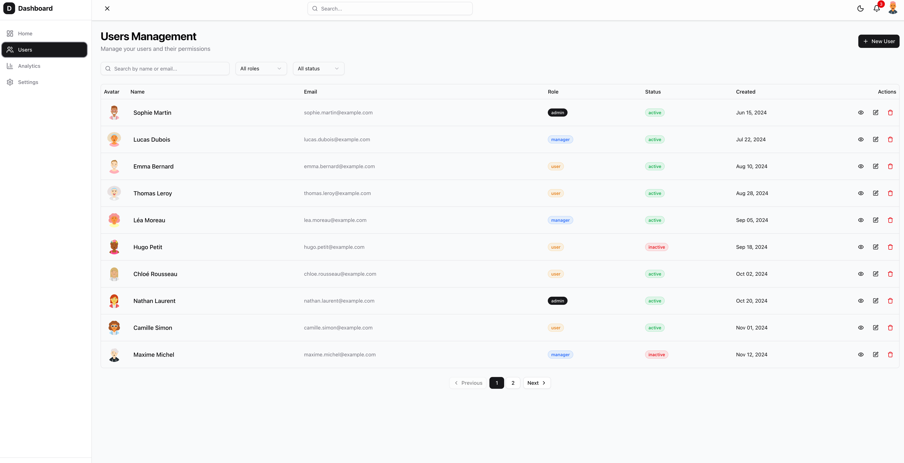
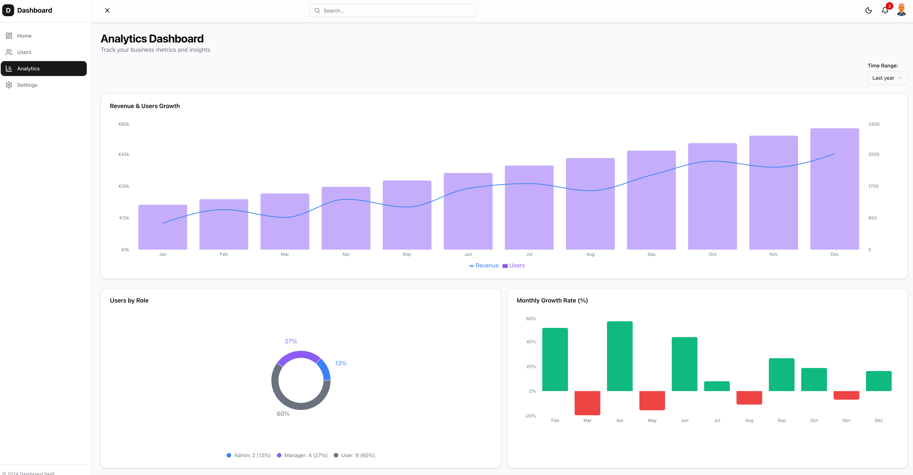
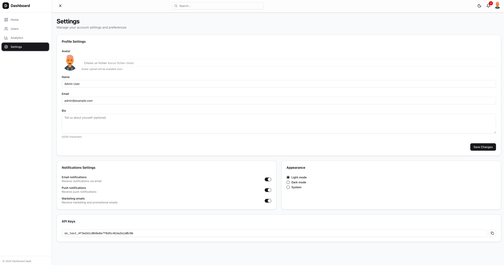
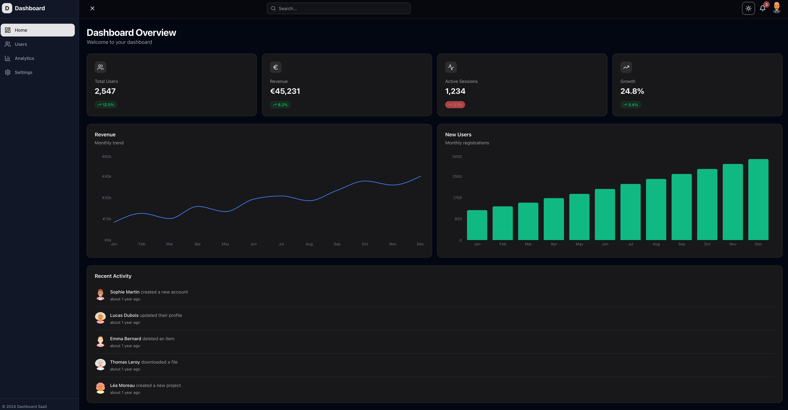

# 🚀 Dashboard SaaS

> Modern, production-ready SaaS dashboard built with Next.js 15, TypeScript, and Tailwind CSS

[](https://nextjs.org/)
[](https://www.typescriptlang.org/)
[](https://react.dev/)

## ✨ Features

- 📊 **Interactive Dashboard** - Real-time KPIs and analytics with beautiful charts
- 👥 **User Management** - Complete CRUD operations with filters and pagination
- 📈 **Advanced Analytics** - Multiple chart types with Recharts (Combined, Pie, Bar charts)
- ⚙️ **Settings Panel** - Profile, notifications, appearance, and API keys management
- 🌓 **Dark Mode** - Light, Dark, and System themes with persistent preferences
- 📱 **Fully Responsive** - Optimized for all devices (mobile, tablet, desktop)
- 🔍 **Search & Filters** - Advanced filtering by name, email, role, and status
- 🎨 **Modern UI** - Built with Shadcn/ui components
- ⚡ **Toast Notifications** - Real-time user feedback with Sonner
- 🔄 **Loading States** - Skeleton loaders and smooth transitions
- ✨ **Animations** - Smooth page transitions with Framer Motion
- 💾 **State Persistence** - Zustand store with localStorage persistence

## 🛠️ Tech Stack

**Frontend:**
- [Next.js 16](https://nextjs.org/) - React framework with App Router
- [TypeScript](https://www.typescriptlang.org/) - Type safety
- [Tailwind CSS](https://tailwindcss.com/) - Utility-first CSS
- [Shadcn/ui](https://ui.shadcn.com/) - Beautiful UI components

**State & Data:**
- [Zustand](https://zustand-demo.pmnd.rs/) - Lightweight state management with persistence
- [React Hook Form](https://react-hook-form.com/) - Form handling
- [Zod](https://zod.dev/) - Schema validation

**Charts & Visualization:**
- [Recharts](https://recharts.org/) - Composable charting library

**Animations & UX:**
- [Framer Motion](https://www.framer.com/motion/) - Animation library
- [Sonner](https://sonner.emilkowal.ski/) - Toast notifications
- [Lucide Icons](https://lucide.dev/) - Beautiful icons
- [date-fns](https://date-fns.org/) - Date formatting and manipulation

**UI Components:**
- [Radix UI](https://www.radix-ui.com/) - Accessible component primitives
- [Class Variance Authority](https://cva.style/) - Component variant management

**Development:**
- [ESLint](https://eslint.org/) - Code linting
- [TypeScript](https://www.typescriptlang.org/) - Static type checking

## 📷 Screenshots

### Overview Dashboard


### User Management


### Analytics


### Settings


### Dark Mode


## 🚀 Getting Started

### Prerequisites

- Node.js 18+ 
- npm, yarn, or pnpm

### Installation

1. **Clone the repository**
```bash
git clone https://github.com/Mehdi-dev7/dashboard-saas.git
cd dashboard-saas
```

2. **Install dependencies**
```bash
npm install
# or
yarn install
# or
pnpm install
```

3. **Run the development server**
```bash
npm run dev
# or
yarn dev
# or
pnpm dev
```

4. **Open your browser**

Navigate to [http://localhost:3000](http://localhost:3000)

## 📁 Project Structure

```
dashboard-saas/
├── public/                 # Static assets
│   ├── screenshots/       # Screenshot images
│   └── *.svg              # SVG icons
├── src/
│   ├── app/               # Next.js App Router
│   │   ├── (dashboard)/   # Dashboard route group
│   │   │   ├── analytics/ # Analytics page
│   │   │   ├── settings/  # Settings page
│   │   │   ├── users/     # Users management page
│   │   │   ├── layout.tsx # Dashboard layout
│   │   │   └── page.tsx   # Dashboard home
│   │   ├── layout.tsx     # Root layout
│   │   ├── page.tsx       # Landing page
│   │   └── globals.css    # Global styles
│   ├── components/         # React components
│   │   ├── analytics/     # Analytics components
│   │   │   ├── CombinedChart.tsx
│   │   │   ├── DateRangeFilter.tsx
│   │   │   ├── GrowthChart.tsx
│   │   │   └── RoleDistributionChart.tsx
│   │   ├── common/        # Common components
│   │   │   └── PageTransition.tsx
│   │   ├── dashboard/     # Dashboard components
│   │   │   ├── ActivityFeed.tsx
│   │   │   ├── KpiCard.tsx
│   │   │   ├── RevenueChart.tsx
│   │   │   └── UsersChart.tsx
│   │   ├── layout/        # Layout components
│   │   │   ├── Sidebar.tsx
│   │   │   └── Topbar.tsx
│   │   ├── settings/      # Settings components
│   │   │   ├── ApiKeySection.tsx
│   │   │   ├── AppearanceSection.tsx
│   │   │   ├── NotificationsSection.tsx
│   │   │   └── ProfileSection.tsx
│   │   ├── ui/            # Shadcn/ui components
│   │   │   ├── avatar.tsx
│   │   │   ├── badge.tsx
│   │   │   ├── button.tsx
│   │   │   ├── card.tsx
│   │   │   ├── dialog.tsx
│   │   │   ├── form.tsx
│   │   │   ├── input.tsx
│   │   │   ├── select.tsx
│   │   │   ├── table.tsx
│   │   │   └── ...
│   │   └── users/         # User management components
│   │       ├── Pagination.tsx
│   │       ├── UserDetailsModal.tsx
│   │       ├── UsersFilters.tsx
│   │       ├── UsersModal.tsx
│   │       ├── UsersTable.tsx
│   │       └── UsersTableSkeleton.tsx
│   ├── lib/               # Utilities and helpers
│   │   ├── data/          # Mock data
│   │   │   └── mockData.ts
│   │   ├── store/         # Zustand store
│   │   │   └── useStore.ts
│   │   └── utils.ts        # Utility functions
│   └── types/             # TypeScript types
│       └── index.ts
├── components.json         # Shadcn/ui configuration
├── next.config.ts         # Next.js configuration
├── package.json           # Dependencies
├── tsconfig.json          # TypeScript configuration
└── README.md              # This file
```

## 🎯 Features Breakdown

### 📊 Overview Dashboard
- 4 interactive KPI cards with trend indicators
- Revenue line chart with gradient fill
- New users bar chart
- Recent activity feed with real-time updates

### 👥 User Management
- Complete CRUD operations (Create, Read, Update, Delete)
- Advanced filtering by role and status
- Real-time search functionality
- Pagination (10 users per page)
- Modal forms with validation
- Avatar display with fallbacks

### 📈 Analytics
- Combined revenue and users chart with dual Y-axis
- Role distribution donut chart with percentages
- Monthly growth rate bar chart with positive/negative indicators
- Date range filter (7d, 30d, 3m, 6m, 1y)

### ⚙️ Settings
- Profile management with form validation
- Notification preferences (email, push, marketing)
- Appearance settings (Light/Dark/System)
- API key management with copy-to-clipboard

## 🎨 Key Features

### State Management
Zustand provides lightweight, scalable state management:
- User data persistence
- Profile settings
- Dark mode preferences
- Sidebar toggle state

### Form Validation
React Hook Form + Zod for robust form handling:
- Type-safe validation schemas
- Real-time error feedback
- Optimized re-renders

### UI/UX Enhancements
- **Loading States:** Skeleton loaders during data fetching
- **Toast Notifications:** Success/error feedback for all actions
- **Animations:** Smooth page transitions with Framer Motion
- **Responsive Design:** Mobile-first approach with Tailwind breakpoints

## 🔧 Development

### Available Scripts
```bash
# Development
npm run dev          # Start dev server

# Production
npm run build        # Build for production
npm run start        # Start production server

# Code Quality
npm run lint         # Run ESLint
npm run format       # Format with Prettier
```

## 🎨 Customization

### Theme Colors
Edit `src/app/globals.css` to customize the color scheme:

```css
:root {
  --primary: 221.2 83.2% 53.3%;
  --secondary: 210 40% 96.1%;
  /* ... */
}
```

### Adding New Pages
1. Create a new file in `src/app/(dashboard)/your-page/page.tsx`
2. Add a route in `src/components/layout/Sidebar.tsx`
3. Wrap the page content with `PageTransition` component

### Adding New Components
1. Create component in appropriate directory under `src/components/`
2. Use Shadcn/ui components for consistency
3. Follow existing patterns for state management and styling

## 📦 Deployment

This project is deployed on [Vercel](https://vercel.com).

[](https://vercel.com/new/clone?repository-url=https://github.com/Mehdi-dev7/dashboard-saas)

## 🤝 Contributing

Contributions are welcome! Please feel free to submit a Pull Request.

1. Fork the project
2. Create your feature branch (`git checkout -b feature/AmazingFeature`)
3. Commit your changes (`git commit -m 'Add some AmazingFeature'`)
4. Push to the branch (`git push origin feature/AmazingFeature`)
5. Open a Pull Request

## 📄 License

This project is licensed under the MIT License.

## 👨‍💻 Author

**Mehdi-dev7**


- GitHub: [@Mehdi-dev7](https://github.com/Mehdi-dev7)

## 🙏 Acknowledgments

- [Next.js](https://nextjs.org/) - The React Framework
- [Shadcn/ui](https://ui.shadcn.com/) - Beautiful UI components
- [Vercel](https://vercel.com/) - Deployment platform

---

⭐ Star this repo if you find it helpful!

Built with ❤️ using Next.js and TypeScript
